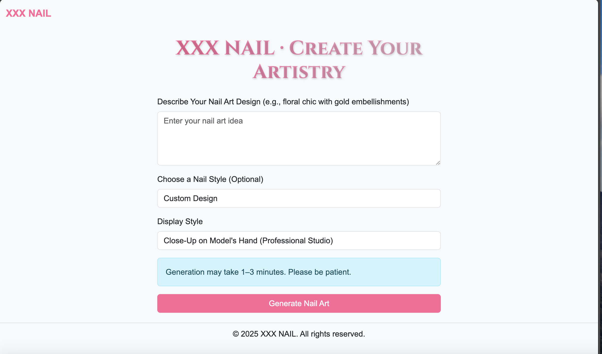
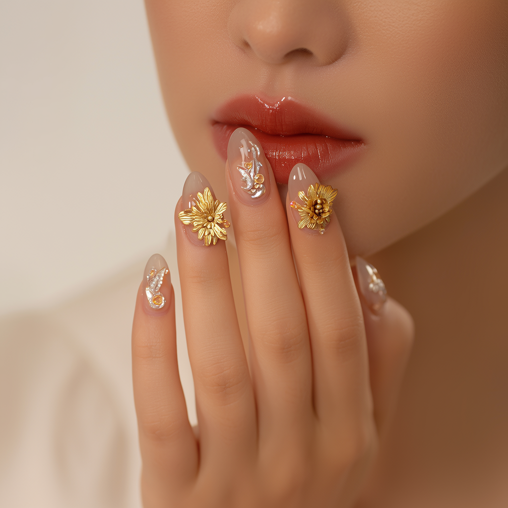

# Nail Art Design Generator
This AI-powered application generates professional nail art designs from natural language descriptions. Built with Flask and Alibaba Cloud's DashScope API, it transforms user concepts into high-quality visual designs.

# Effect Illustration Display




# Functional Features 
* Intelligent prompt optimization: Automatically optimize user input using the Qwen language model to improve the quality of image generation.
* Two display styles:
  - Close-up of the model's hand (professional photography studio effect)
  - Static display of the desktop (professional still life photography effect)
* Default design template: Offer three professional nail design templates for users to choose from.
* **Asynchronous task processing** : Perform image generation tasks in the background asynchronously to avoid page blocking.

# Technology Stack
- **Backend**: Python Flask
- **AI Engine**: Alibaba Cloud DashScope (qwen-max [text prompt optimization processing], wanx2.1-t2i-plus [image generation])
- **Frontend**: HTML + Custom CSS
- **Asynchronous Processing**: Polling state mechanism

# Clone repository
```bash
git clone https://github.com/yourusername/nail-art-generator.git
cd nail-art-generator
```

# Create virtual environment
```bash
python -m venv venv
```

# Activate environment (Linux/Mac)
```bash
source venv/bin/activate
```

# Activate environment (Windows)
```bash
.\venv\Scripts\activate
```

# Install dependencies
```bash
pip install -r requirements.txt
```

# Set API key
```bash
DASHSCOPE_API_KEY=your_api_key_here > .env
```

# Run application
```bash
python app.py
```
Visit http://localhost:5001 to start designing!

# Expand the gameplay
You can delpoy them to the web server!!!
